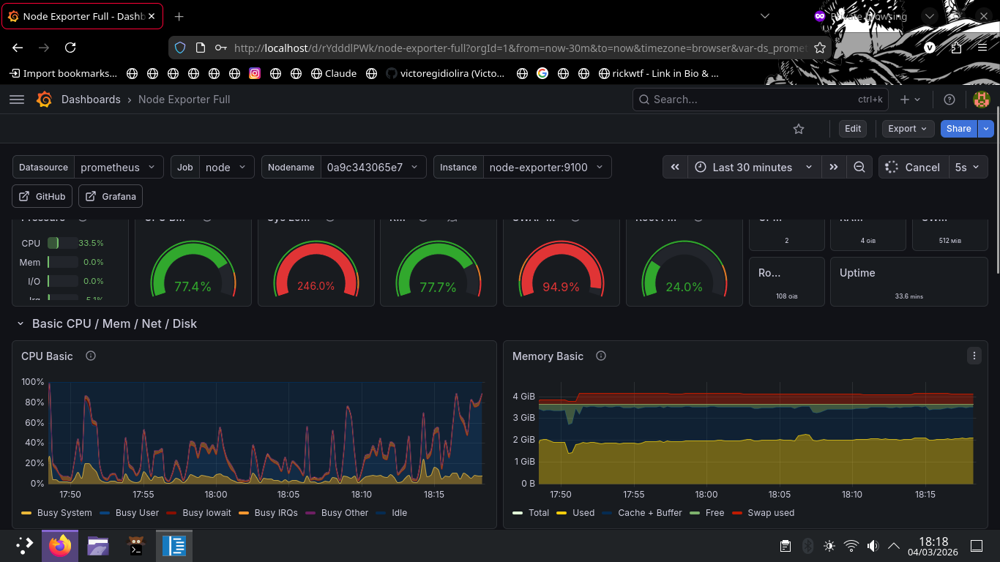

# 🚀 Observability & Automation Home Lab

Este projeto demonstra o provisionamento automatizado de um ambiente Linux monitorado, utilizando containers para isolamento de serviços e métricas em tempo real.

## 🛠️ Tecnologias Utilizadas
- **Docker & Docker Compose**: Orquestração da stack.
- **Prometheus**: Banco de dados de séries temporais para métricas.
- **Grafana**: Visualização de dados e dashboards.
- **Nginx**: Proxy reverso para acesso seguro ao painel.
- **Bash**: Scripts de automação (`setup_env.sh`) e geração de carga (`stress_test.sh`).

## 📋 Como Executar
1. **Provisionamento**: `./setup_env.sh` (Instala dependências e configura firewall).
2. **Deploy**: `docker-compose up -d`.
3. **Monitoramento**: Acesse `http://localhost` (Porta 80 via Nginx).
4. **Teste de Carga**: `./stress_test.sh` para gerar picos de consumo.

## 📈 Evidência de Funcionamento
Abaixo, o gráfico de CPU demonstrando o pico de processamento capturado pelo Prometheus durante a execução do script de estresse:

---
*Nota técnica: O ambiente foi configurado com limites de recursos (Resource Quotas) para garantir a estabilidade do host durante os testes de carga.*